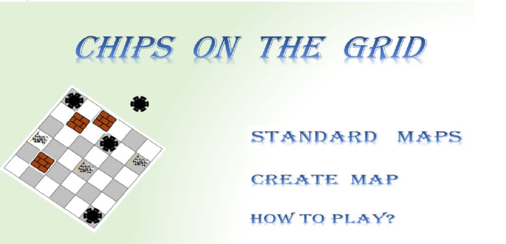

# PuzzleGameProject

Writing a puzzle game based on codeforces problems. 
Chips on the grid is simple puzzle game. The objective is to move all chips to the targeted positions.
In one move, we can slide all chips in the same direction and each chip will slide until hitting walls or holes in the grid.
The game is over if any chips fall into the holes.

I created some maps which are available on standard maps menu.

I also provided create map pages which allowed you to simulate and play your own custom maps.
The size of grids, number of chips, and number of goals can be customized as long as number of chips is not greater than number of goals.
